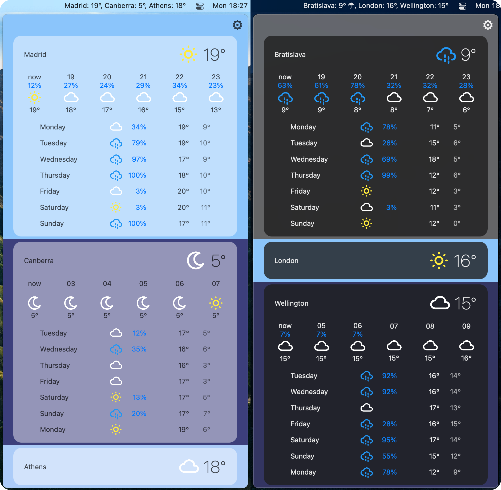

# ⛄️ Snowman

macOS status menu weather app written in SwiftUI.

## Table of Contents

- [Screenshots](#screenshots)
- [Building a Snowman](#building-a-snowman)

## Screenshots

## Building a Snowman

### Requirements

- macOS 10.15+
- Swift 5.2+
- Xcode 11+
- API key for a weather API service

### Development Setup

Add your API key to API Service initialization in `AppDelegate`. Note that distributing the app with an API key is **insecure** and this approach is only acceptable for personal use or testing. For any distribution purposes, use custom backend or the [SnowmanBackend](https://github.com/onehappycat/snowman-backend).

### Implementing Support for an API Service

- Conform to `APIServiceProtocol`.
- Initialize the service in `AppDelegate` and inject it into `LocationsListViewModel`.
